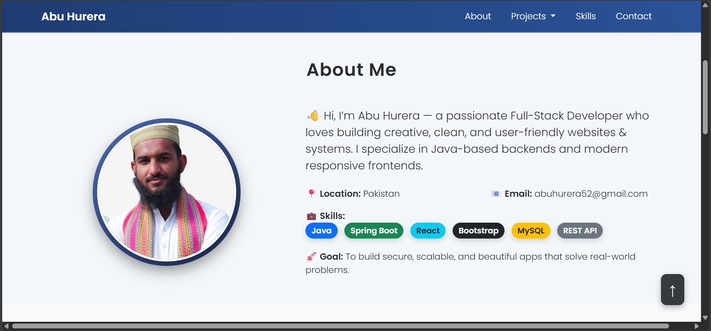

# 💼 Abu Hurera's Portfolio

Welcome to my personal developer portfolio!  
This website showcases my projects, skills, and a bit about who I am as a developer.

---

## 🔗 Live Demo

🌐 [View Portfolio](https://velvety-raindrop-68e2ba.netlify.app/)  

📁 [GitHub Repository](https://github.com/AbuHurera05/PortFolio)

---

## 📸 Screenshots



---

## 🚀 Technologies Used

- **HTML5** – Semantic, accessible, and clean markup  
- **CSS3** – Responsive design, modern animations, hover effects  
- **JavaScript (ES6)** – Scroll effects, interaction logic  
- **Bootstrap 5** – Grid system, responsive utilities, components  
- **Typed.js** – Typing animation  
- **AOS (Animate on Scroll)** – Smooth animations on scroll  
- **GitHub Actions (optional)** – For CI/CD integration

---

## 📂 Features

- ⚡ Responsive Design
- 💡 Animated Landing Section
- 🧑‍💻 About Me Section
- 💼 Projects Showcase
- 📧 Contact Form
- 🔝 Scroll-to-top Button
- 🌙 Dark Mode (optional)
- 📱 Fully Mobile Friendly

---

## 🧑‍💻 About Me

Hi, I'm **Abu Hurera** – a passionate developer from Pakistan 🇵🇰.  
I love creating clean, elegant, and functional websites using modern tech stacks.

---

## 📬 Contact

- Email: junejoabuhurera52@gmail.com  
- LinkedIn:   
- GitHub: [AbuHurera05](https://github.com/AbuHurera05)

---

## 📌 Setup Instructions

To run this portfolio locally:

```bash
git clone https://github.com/AbuHurera05/PortFolio.git
cd PortFolio
# Open index.html in browser
